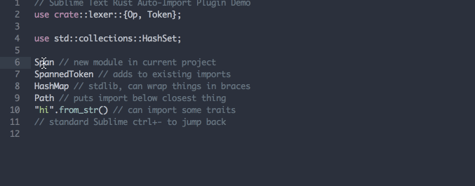

# Sublime Rust Auto-Import

This is a Sublime Text 3 plugin for automatically creating imports in Rust.
It provides the `rust_auto_import` command which you can bind to a key (or use from the context menu or command pallete). When used with the cursor on an identifier, it automatically `use`s the (hopefully) correct path at the top of the file.

## Features

- Uses Sublime's index to find the module for items in the current crate
- Has a pre-programmed list of common `std` imports like `HashMap`
    - Even some traits like `std::str::From` with your cursor on `from_str`
- Places new imports under the existing import with the most similar prefix
- Adds in brackets if an import from that module already exists
- Adds the old position to the jump stack so you can hit `ctrl+-` to jump back to where you were

## Demo GIF



## Installation

`git clone` this repository into your Sublime Text packages folder. Maybe I'll bother to add this to Package Control at some point.

Then add a keybinding for the `rust_auto_import` command, by adding a line like this to your keybindings file:

```json
{ "keys": ["ctrl+a"], "command": "rust_auto_import" },
```

## Disclaimers

Feel free to send a PR if you want to fix one of these.

- Currently uses the 2018 edition import style with no setting to change it
- Only includes a limited set of standard library includes
- Uses hacky regexes instead of real parsing
- Doesn't fully support nested braced imports
